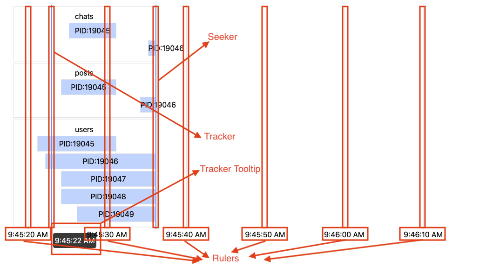

# RealtimeChart

RealtimeChart is a React component for rendering timeseries-based data in realtime chart format.

## When?

Use RealtimeChart (over [TimeseriesChart](/docs/timeseries-chart)) for more arbitrary form of data, you want a finer control of the updates timing.

## Usage

```jsx
<RealtimeChart
    width="100%"
    currentTime={time}
    onClick={(evt, time) => console.log(`Maps to ${time} here!`)}
    rows={buckets}
    renderRow={(bucket, Row) => {
        return (
        <Row start={bucket.start} end={bucket.end}>
            {bucket.data}
        </Row>
        );
    }}
/>
```

RealtimeChart will re-render every time you pass new values to `currentTime` or `rows` props, giving you the realtime update effect. You need to transform your data to the format that `rows` expects: [Bucket](/docs/types#bucket)[]

## Props

| Prop | Type | Required | Default | Description |
| --- | --- | --- | --- | --- |
| width | `number` or `string` | No | `'100%'` | The width of the chart. If given in `number`, the width is set in `px`. If given in string, it tries to parse into `%`, relative to the parent element. |
| renderRow | [RenderRowFunc](/docs/types#renderrowfunc) | Yes | - | The function which formats the row. It's passed a bucket and the `Row` React component. Must return a JSX which is up to you to format and render as you like. |
| onClick | `(MouseEvent, number) => void` | No | `() => {}` | The function that gets triggered when user clicks on the chart. It gets reference to the `MouseEvent` which triggered this function, and a number representing the time within the chart (mapped by the position within the chart). |
| onFrameChange | `({ start: number, end: number }) => void` | No | `() => {}` | Executed when the chart's timeframe changes. Timeframe changes when the chart's boundary is recaulculated and re-rendered. The `start` and `end` passed are the new timeframe's start and end time. |
| renderNoDataFallback | `() => ReactElement` | No | `() => <div>Waiting for data...</div>` | The function that returns a JSX when `newBucket` prop is `undefined`. |
| containerClass | `string` | No | `""` | A list of HTML class names for the chart's container. |
| containerStyle | `Object` | No | `{}` | An object of React inline styles for the chart's container. |
| options | [Options](/docs/realtime-chart#options) | No | `{}` | Refer to the [Options](/docs/realtime-chart#options) section below. |

## Options

| Prop | Type | Required | Default | Description |
| --- | --- | --- | --- | --- |
| frameCycle | `number` | No | 60000 | The length of the time frame lifecycle in milliseconds, where one time frame represents the period that chart remains with the same time range between updates. |
| rulerInterval | `number` | No | 5000 | The time interval between each ruler. Not applicable if `hideRuler` option is `true`. |
| hideRuler | `boolean` | No | `false` | If true, hide the ruler (see the image below). |
| hideSeeker | `boolean` | No | `false` | If true, hide the seeker (see the image below). |
| hideTracker | `boolean` | No | `false` | If true, hide the tracker (the vertical line which tracks the mouse position - see the image below). |
| hideTrackerTooltip | `boolean` | No | `false` | If true, hide the tooltip for the tracker. |
| formatRulerInterval | `(number) => string` | No | `(pos: number) => "" + pos` | Formats the time label shown for the rulers and tracker tooltip. |

---


